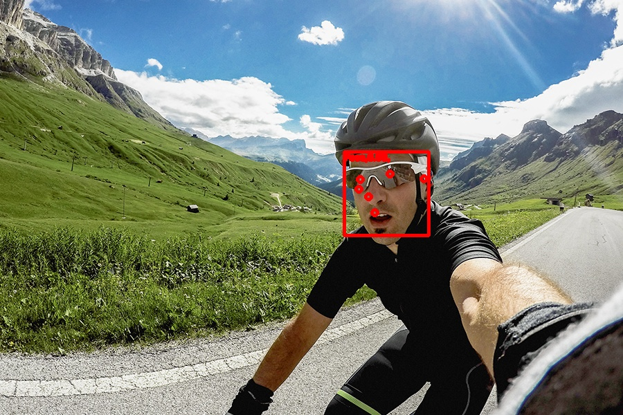

# Face Detection

To run:

```
python3 face_detection.py
```

This image shows the 6 distinct full-body landmarks:

<p style="text-align:center">
     
</p>

The landmarks are represented like this

```
0 label_id: 0
score: 0.6568325161933899
location_data {
  format: RELATIVE_BOUNDING_BOX
  relative_bounding_box {
    xmin: 0.5285224914550781
    ymin: 0.35105907917022705
    width: 0.12865996360778809
    height: 0.22872817516326904
  }
  relative_keypoints {
    x: 0.5880647897720337
    y: 0.4050712585449219
  }
  relative_keypoints {
    x: 0.6273521184921265
    y: 0.4141755700111389
  }
  relative_keypoints {
    x: 0.619330108165741
    y: 0.4424302577972412
  }
  relative_keypoints {
    x: 0.6107641458511353
    y: 0.4944416284561157
  }
  relative_keypoints {
    x: 0.537966787815094
    y: 0.44004327058792114
  }
  relative_keypoints {
    x: 0.6311169266700745
    y: 0.45269328355789185
  }
}
```

To read more about this go [here](https://google.github.io/mediapipe/solutions/face_detection).
