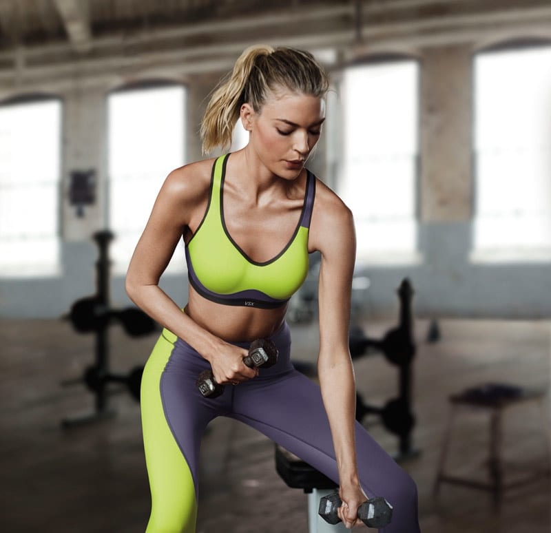
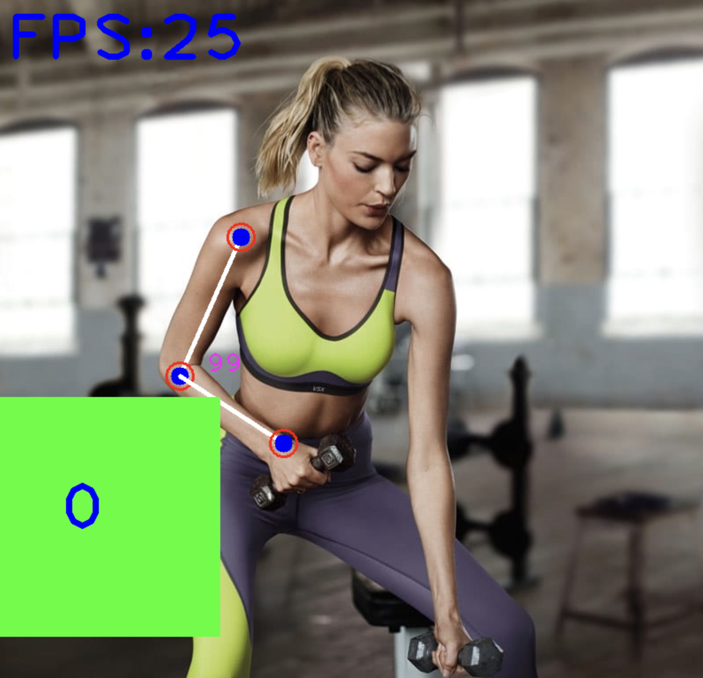

# AI Personal Trainer

This is one of the applications of pose estimation module.

To run:

```
python3 ai_trainer.py
```

Using any three landmarks we can find the angle between them. Depending upon the angle at the moment we can determine how well a person is training.

<p style="text-align: center">

</p>

In the example, we have considered hand exercise and we count the number of curls a person has completed. We have also added a bar to calculate the accuracy of the exercise.

<p style="text-align: center">

</p>
